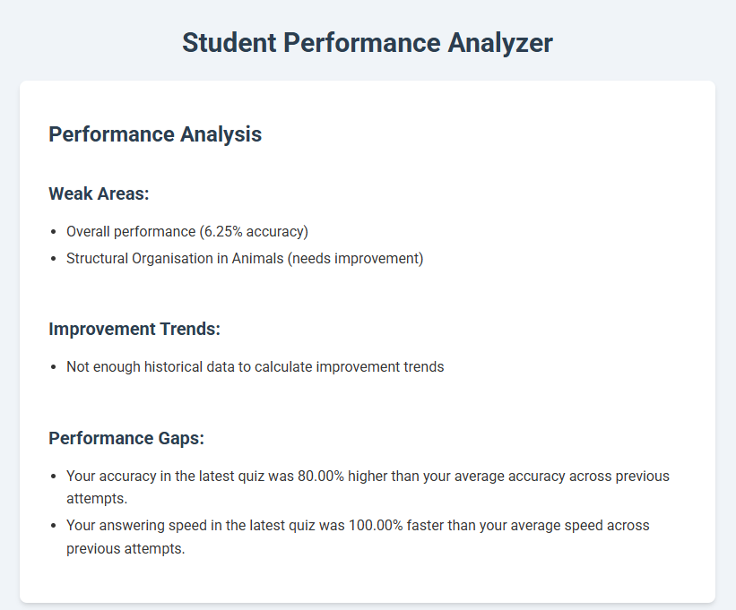
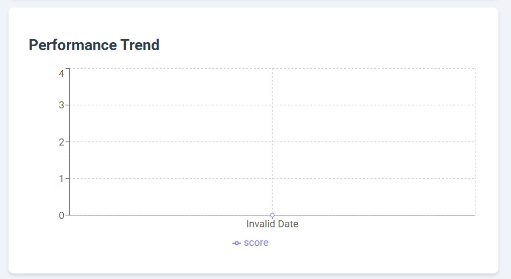
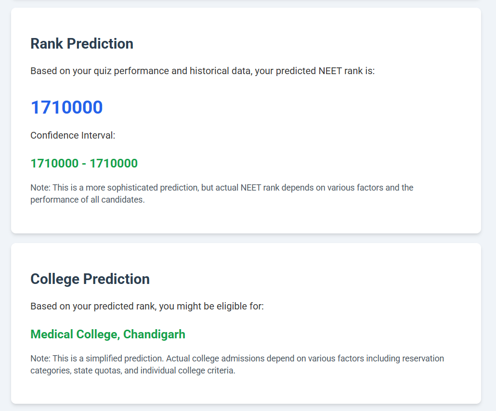

# NEET Performance Analyzer

## 📌 Overview
This project analyzes quiz performance and predicts student rankings for the NEET exam based on past results. The solution provides insights into students' weak areas, improvement trends, and likely college admissions.

## 🚀 Tech Stack
- Vite + React (JavaScript)
- **APIs:** NEET Testline API (Quiz Data, Historical Data)

## 🎯 Features
- **Performance Analysis:** Identifies weak topics, accuracy trends, and difficulty levels.
- **Rank Prediction:** Uses past NEET exam results to predict the student's rank.
- **College Prediction:** Estimates possible college admissions based on rank.


## 🔧 Installation & Setup
### 1️⃣ Clone the Repository
```bash
git clone https://github.com/amank1902/student-rank-predictor.git
cd student-rank-predictor
```

### 2️⃣ Install Dependencies
```bash
npm install
```
### 3️⃣ Start the Server
```bash
npm run dev
```
The app will be running at http://localhost:3000 🚀

## 🛠 Approach & Methodology
1. **Data Collection:**
   - The application fetches real-time quiz performance data from APIs.
   - Historical quiz data is retrieved for trend analysis.

2. **Performance Analysis:**
   - Evaluates user responses to identify weak topics.
   - Tracks accuracy trends and difficulty level patterns.

3. **Rank Prediction:**
   - Uses weighted scoring techniques based on past NEET exam results.
   - Ranks are estimated using weighted scoring based on past NEET results and performance trends.

4. **College Prediction:**
   - Maps predicted rank to past NEET college admissions data.
   - Suggests possible colleges based on cutoff trends.
   
## Screenshots & Visualizations

Here are some visualizations related to the project:

<!-- First row with two images side by side -->
<div style="display: flex; justify-content: space-between;">
  
  
</div>

<!-- Second row with one image -->


